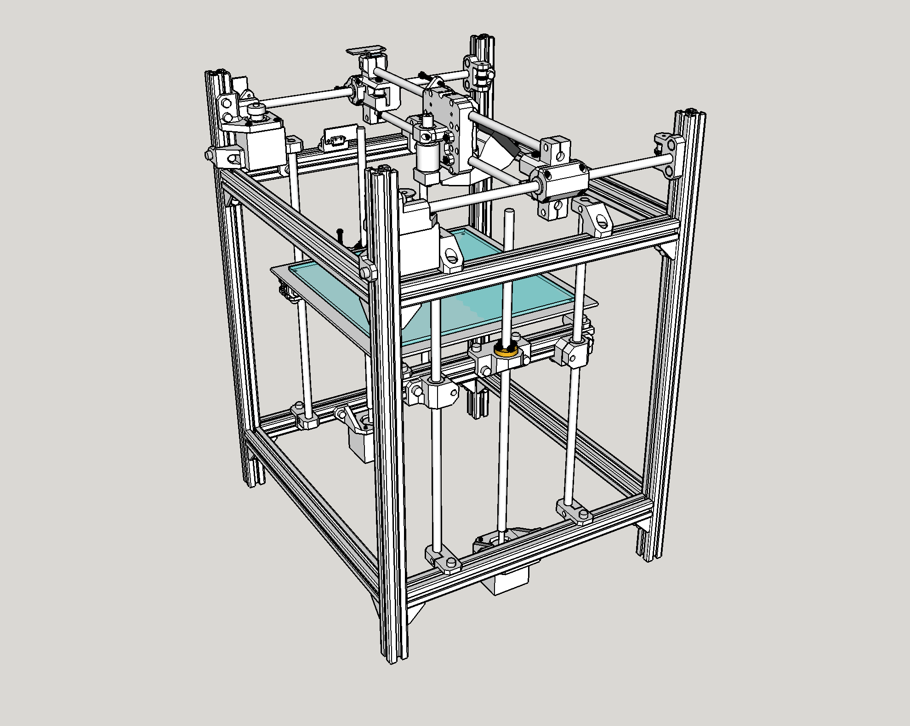

# P-Winter V1 (archive)

## Welcome
- P-Winter is a CoreXY 3D printer. It aims for an accessible BOM and assembly, with drop-in nuts and a fully-bracketed frame.
- There are major flaws with this design. It was made predominantly when I was 14 with zero experience.
- I am working on P-Winter V2, which will reuse most of the components iron out some silly design flaws and misunderstandings from V1. Well, I had basically completed the V2 concept in SketchUp, but when I went to model it properly in Fusion 360, the files had disappeared! >:(
- V1 cost estimate: approx 50 GBP for non-printed parts in the final printer, not including prototyping waste.

# V2 Changes
## Overview
There were a few fatal flaws and inconveniences with V1. V2 strives to fix most of these. V2 primarily aims for a more sensible belt path, a more sensible Z axis, a filtered enclosure, a (larger) more sensible build volume.

## Dimensions and V2 Enclosure
- V1 Frame (2020 T-slot extrusions): 380mm x 340mm x 500mm
- V1 Build volume: approx 210mm x 199mm x 270mm
- V2 will use the same frame with added extrusions for the enclosure and other attachments (e.g. filters).
##
- The V1 frame was not enclosable due to part of the XY spilling out to the sides and to the top.
- V2 changes this, compacting the design while offering a larger build volume. The current build footprint in CAD is at least a comfortable 220mm x 220mm.
- The Z axis is being shortened to enable the toolhead's Bowden tube and wiring to be enclosed comfortably.
- Previously, the electronics for V1 where pulled outside an external enclosure to keep them cool. For V2, the electronics will be hidden at the bottom of the printer, separated from the heated chamber via an air gap.
- Some enclosure circulation/filtration shenanigans.

## CoreXY
- V1 uses 8mm linear rods: 2x 300mm for Y and 2x 350mm for X.
- These are retained for V2. V2 will use LM8LUUs for Y and LM8UUs/LM8LUUs for X.
##
- V1 used 16T GT2 pulleys and idlers and 6mm steel-core GT2 belts, with 38mm NEMA 17 stepper motors.
- The knockoff pulleys and idlers had questionable bearing quality/centred-ness/profile accuracy. Additionally, I had spaced them incorrectly in the previous belt path. The idlers also did not operate smoothly on the threaded bolts I was using to hold them.
- The steel-core belts had questionable thickness and were incompatible with the small bend radius of the 16T pulleys and idlers.
- V2 will use proper belts and use stacked F695 flanged bearings as idlers. These have larger bearings suited for motion, are more likely to be round and centred, and also have more predictable dimensions than cheap toothed idlers. V2 will use dowel pins to hold these idlers properly.
##
- V1 used a Hypercube-based belt path where the AB motors occupied space at the front of the Y axis. The motors were an eyesore and limited the travel in Y.
- The belt path has been completely redrawn for V2. It is now correctly aligned and parallel, and I have brought it as close to the enclosed extremities as possible, increasing travel significantly in both X and Y. The AB motors have been moved to the back of the frame.
- The AB motors no longer need to be aligned with the belt path. The diameter of the pulleys no longer matter either. Either 16T or 20T can be used with minimal modification.
##
- Some magic with the belt path leaves 307mm of available rod length in the X axis. This allows for an 85mm-wide X carriage to travel 220mm comfortably in the X direction.
- The motors being in the back of the frame increases the available rod length to 267mm (up to 282mm). A 45mm-wide Y carriage can confortably travel 220mm in the Y direction.
- These limits can be pushed, but I am sticking to (220mm)^2 for now. The bed is (250mm)^2 so I can modify printer dimensions as desired after I get it working.
##
- In V1, the motor mounts began to deform due to belt tension and motor weight acting together. The V2 motor positioning allows for a stronger, thicker mount with better-placed bolting holes. The belt tension now acts against the weight of the motor.

## Z axis
- V1 used a dual-Z setup with two 8mm x 350mm linear rods and a 350mm leadscrew on each side of the frame. (The 350mm leadscrew is too long for 350mm linear rods when using regular leadscrew nuts but this is not a major issue). This offered approximately 270mm in vertical travel
- V2 will use a similar setup with 4 rods and 2 (maybe 3) leadscrews, but shorten the Z axis to enclose the printer better.
##
- The original V1 -> V2 plan was to implement automatic bed levelling with three independent leadscrews. I decided against this because an effective triple Z requires an additional axis, two additional steppers and two additional drivers. There is a risk of overconstraint and having 3 leadscrews may introduce other artefact problems. Overall these are resources I would prefer to allocate to my 300mm printer project.
- I might still add a ABL sensor to V2.
- A 220mm printer really should just be properly trammed...
##
- The V1 setup used separate Z carriages on each side of the printer, connected only via the heated bed and bed levelling springs. The carriages were atrocious to tram relative to each other and to the frame.
- V2 will use a rectangular frame made from 4 extrusions, with the bed bolted directly to the T-slot channels using silicon spacers. This will be far stiffer and easier to level.

## Toolhead
- V1 used a V6 Volcano clone in a Bowden setup. V2 will keep this or use a HGX-LITE clone in direct drive.
- V1 did not end up with any part cooling. My newbie duct design had nil airflow and collided with the belts in the back, so I got rid of it and left it to V2.
- V2 will use dual 5015s for part cooling.

## Electronics
- The original setup was a classic 12V Mega/RAMPS/A4988 setup running Marlin 2.0. This was undeniably the cheapest possible setup and what I'm used to.
- Marlin took forever to compile. 3-axis hardware is not hard to build, but I'd like to get more involved with the software side of 3D printers. The new setup will run on Klipper and have an ADXL which will be fun.
- I will be switching from 12V to 12V + 24V electronics. The heated bed could barely reach 75 deg C, so I will be supplying 24V to at least the heated bed, and potentially other components if I ever need to push performance.
- Silent stepper drivers.
- Known thermistors rather than mystery 100k.

## V1 Performance and Other V2 Improvements
- Prints suffered from a wobble/layer shifting in the Y direction, on average in the correct position. I suspect this was due to play in the X axis rods and hot end nozzle, misalignment in the belt path and improperly-tuned stepper drivers. In V2, rods and bearings will be clamped down on rather than clipped or press-fitted into place.
- V1 homing used Makerbot-style endstops that are triggered by adjustable bolts on the moving carriage. This precision adjustment was good for the Z axis but unnecessary for the X and Y axes. Switching to simpler triggers.
- In general V2 is a design made by a more experienced me. The parts are more functional and the CAD is more detailed, avoiding issues in V1 where the lack of detail meant that bolts were inaccessible or that things would collide with the belt path. New models check for interference, etc and are much more mature.

## V2 Predicted Issues/Advice To Self
- Centre of mass imbalance on the X rods.
- Check the continuity of endstop switches and the resistance of heaters/thermistors with a multimeter. It took forever to figure out why the linear voltage regulator on my Mega kept frying. There was a solder bridge short circuit on one of my endstops!!!
- Tune steppers properly.
